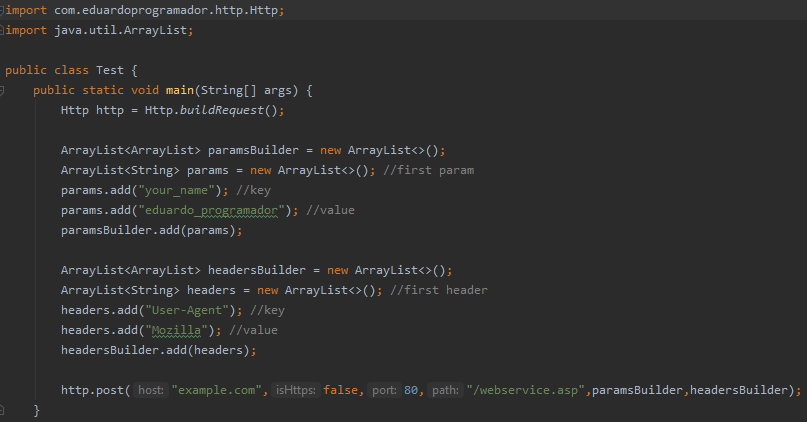

# Http

## A full and easy Java library for make POST and GET requests, and some other usefull tasks.

## Tutorial:

### 1) Import the Http.jar onto your Java Project

### 2) Read the class documentation

### 3) Example of Usage:

Copyright 2022. Eduardo Programador